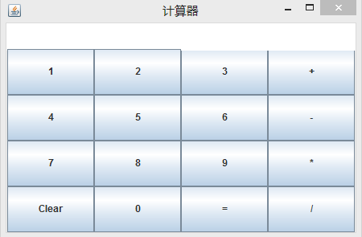
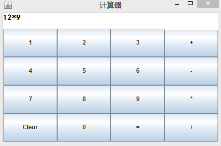
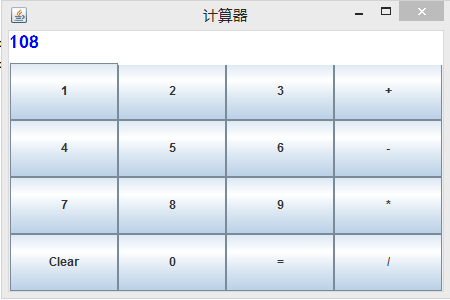

# SimpleFactory
#### 这是简单工厂模式的应用————简单计算器

#### 运行图如下：

#### 测试例子：
package simplefactory;

public class Test {

	public static void main(String[] args) {
		Operate opt;
		opt = OperateFactory.createOperate("+");
		opt.numA = 5;
		opt.numB = 6;
		System.out.println(opt.getResult());
	}
}

##### 在该例子中，点击“+，-，*，/”后先获取文本域的值，为第一个操作数，点击“=”时，先解析出第二个操作数及操作符，然后使用简单工厂模式计算表达式的值。

##### 点击“=”后的一系列操作：

			int len = str.length();
			str = result.getText();
			String op = str.substring(len, len+1);
			str = str.substring(len+1);
			numB = Integer.parseInt(str);
			
			
			Operate opt;
			opt = OperateFactory.createOperate(op);
			opt.numA = numA;
			opt.numB = numB;
			int end = opt.getResult();
			
			result.setForeground(Color.BLUE);
			result.setFont(new Font("黑体", Font.BOLD, 18));
			result.setText(Integer.toString(end));

##### 点击“+，-，*，/”后的一系列操作（以“*”为例）：

			str = result.getText();
			numA = Integer.parseInt(str);
			result.append("*");
